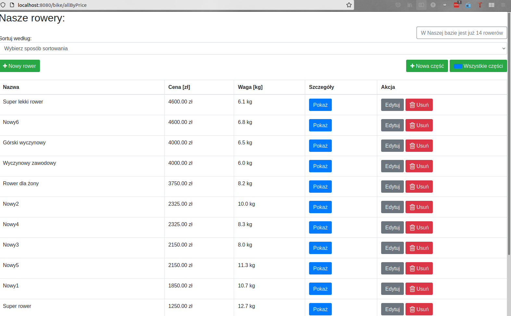
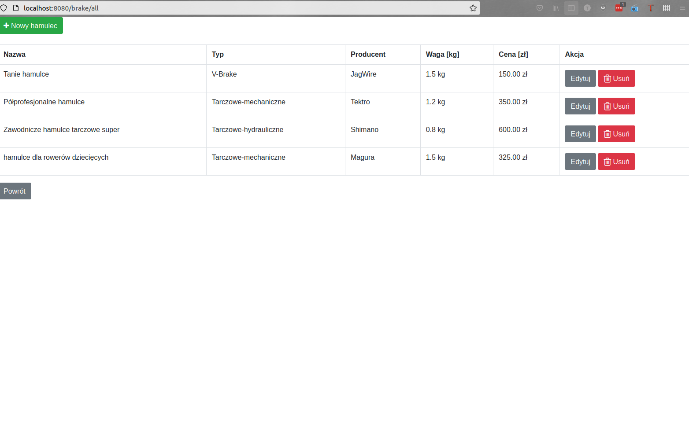
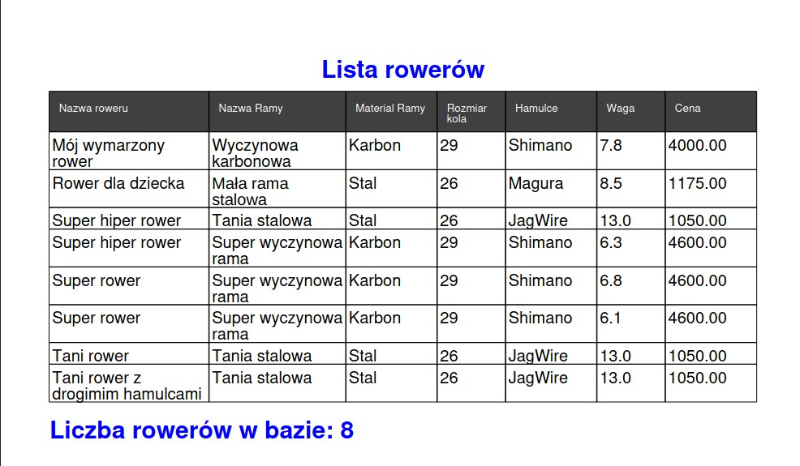

# Bike Configurator

<!--
[Check out the demo](https://jacek-malek-bike-configurator.herokuapp.com/).
-->

## Table of Contents
* [General Info](#general-information)
* [Technologies Used](#technologies-used)
* [Features](#features)
* [Screenshots](#screenshots)
* [Contact](#contact)

## General Information
- A simple bicycle configurator that makes it easy to find the perfect bike.

## Technologies Used
- Java
- Spring
- Hibernate
- Spring Boot
- MySql
- Bootstrap

## Features
List the ready features here:
- bikes and parts CRUD
- sorting available bikes
- creating pdf reports

## Screenshots

## Contact
Created by [Jacek Małek](mailto:jac.malek@gmail.com) - feel free to contact me!
